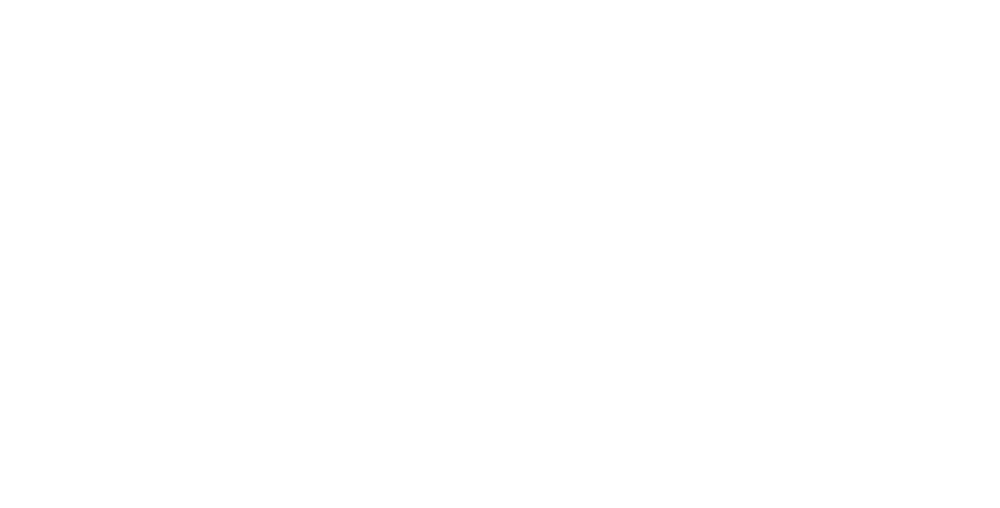

# Проект по автоматизации тестирования для [](https://reqres.in/)

## :computer: Используемый стек
<p align="center">
<a href="https://www.jetbrains.com/idea/"></a> 
<a href="https://www.java.com/"></a>
<a href="https://gradle.org/"></a> 
<a href="https://junit.org/junit5/"></a> 
<a href="https://github.com/"></a> 
</p>

## :ballot_box_with_check: API тесты для пользователей

- ```POST /api/users``` -- создание
- ```PUT /api/users/2``` -- обновление
- ```PATCH /api/users/2``` -- частичное обновление
- ```DELETE /api/users/2``` -- удаление 
- ```GET /api/users?page=2``` -- получение списка, 2ая страница